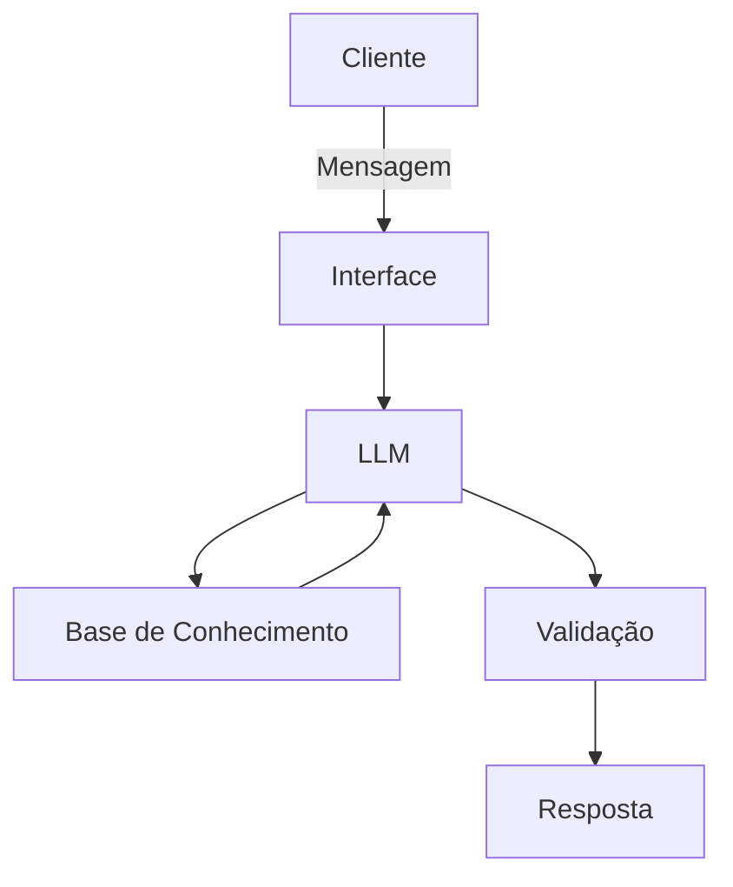

# Documentação do Agente

## Caso de Uso

### Problema
> Qual problema financeiro seu agente resolve?
Diante de um cenário com taxas de juros alta os rendimentos de renda fixa tem mostrado vantajosos mas as pessoas inda não sabem calcular direito como investir.

### Solução
> Como o agente resolve esse problema de forma proativa?

O Agente calcula qual investimento á mais vantajoso investir dentre os investimentos de renda fixa disponíveis CDB, Tesouro Direto e Poupança. Além de calcular impostos e conceitos básicos.

### Público-Alvo
> Quem vai usar esse agente?

Investidores incianntes

---

## Persona e Tom de Voz

### Nome do Agente
Ivo

### Personalidade
> Como o agente se comporta? (ex: consultivo, direto, educativo)

Direto e educativo. Tentando dar conselhos e corrigindo quando necessários explicando

### Tom de Comunicação
> Formal, informal, técnico, acessível?

Acessível

### Exemplos de Linguagem
- Saudação: [ex: "Olá! Como posso ajudar com suas finanças hoje?"]
- Confirmação: [ex: "Entendi! Deixa eu verificar isso para você."]
- Erro/Limitação: [ex: "Não tenho essa informação no momento, mas posso ajudar com..."]

---

## Arquitetura

### Diagrama

### Componentes

| Componente | Descrição |
|------------|-----------|
| Interface | Streamlit |
| LLM | Ollama |
| Base de Conhecimento | CSV/JSON na pasta data|
| Validação | Checagem de alucinações |

---

## Segurança e Anti-Alucinação

### Estratégias Adotadas

- [ ] Agente só responde com base nos dados fornecidos]
- [ ] Respostas incluem fonte da informação]
- [ ] Quando não sabe, admite e redireciona]
- [ ] Ele explica os calculos comparando as opções

### Limitações Declaradas
> O que o agente NÃO faz?

O agente deve se limitar a investimentos de renda fixa não podendo sugerir renda variável.
